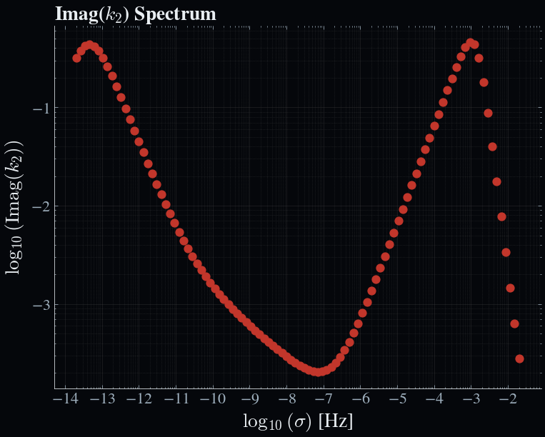

# Zero-dimensional test case: The Moon

This is a simple test case to demonstrate the use of Obliqua for a zero-dimensional model of the Moon. We will create a basic data lookup table for the Moon's tidal ``k``-Love number response. 

---

### Prerequisite

- Ensure that you have the `Obliqua` package installed.

---

### Creating the data file

Use your favourite file editor IDE to create a new file called `0d_test_moon.json` in the `res/interior_data` directory of the Obliqua package. The data file should be a JSON file with the following structure:

```json
{
    "omega": 1.0e-06,       // Orbital frequency in rad/s
    "axial": 1.0e-06,       // Axial rotation frequency in rad/s
    "ecc": 0.1,             // Orbital eccentricity
    "sma": 1.82e7,          // Semi-major axis in meters
    "S_mass": 6e24,         // Mass of the central body in kg
    "density": [            // Radial density profile in kg/m^3
        3500.0,             // Solid mantle density
        3500.0              // Molten crust density
    ],
    "radius": [             // Radial radius profile in meters
        480000.0,           // Radius of the iron core in meters
        995613.0,           // Radius of the solid mantle in meters
        1650000.0           // Radius of the molten crust in meters (i.e. the surface)
    ],
    "visc": [               // Viscosity profile in Pa.s
        1e22,               // Viscosity of the solid mantle in Pa.s
        1e2                 // Viscosity of the molten crust in Pa.s
    ],
    "shear": [              // Shear modulus profile in Pa
        65857968278.256905, // Shear modulus of the solid mantle in Pa
        10.0                // Shear modulus of the molten crust in Pa
    ],
    "bulk": [               // Bulk modulus profile in Pa
        147739735943.7933,  // Bulk modulus of the solid mantle in Pa
        1000000000.0        // Bulk modulus of the molten crust in Pa
    ],
    "phi": [                // Porosity profile (dimensionless)
        0.0,                // Porosity of the solid mantle (dimensionless)
        1.0                 // Porosity of the molten crust (dimensionless
    ]
}
```

The values provided here reflect a partially molten Moon, with a fluid iron core, a solid mantle, and a partially molten crust. Although we do not require the orbital parameters for this test case, we still need to provide them in the data file. The values provided here are arbitrary and do not affect the tidal response calculations.

---

### The configuration file

The configuration file should be a TOML file with the following structure:

```toml
title = "Moon"                      # Given title for the configuration file
version = "1.0"

[params]
    [params.out]
        path        = "out"         # Set the outpath for the output files
        time        = 0.0
        logging     = "INFO"
        plot_fmt    = "png"

# Orbital system
[orbit]
    [orbit.obliqua]
        store_3D    = false
        enforce_ec  = false
        optimize_scales = false
        solid_shell = false

        min_frac    = 0.05
        visc_l      = 1e2
        visc_lus    = 1e3
        visc_s      = 1e22
        visc_sus    = 1e21
        n           = [2]
        m           = [0, 2]
        spectrum    = "full"        # Specify the use of the full spectrum 
        N_sigma     = 100           # Set the number of probe forcing frequencies
        p_min       = -8            # Set the minimum probe forcing frequency (in [log(kyr)])
        p_max       = 4             # Set the maximum probe forcing frequency (in [log(kyr)])
        s_min       = "none"
        s_max       = "none"
        
        material_mu = "andrade"     # Set the rheological model to use for the shear modulus
        material_k  = "andrade"     # Set the rheological model to use for the bulk modulus
        alpha       = 0.3           # Set the Andrade power-law exponent.

        module_solid = "solid0d"    # Set the tidal model to use for the solid layer
        module_mushy = "none"       
        module_fluid = "fluid0d"    # Set the tidal model to use for the fluid layer

        [orbit.obliqua.solid]
            ncalc       = 100
            dr_min      = 300
            dr_max      = 3000
            core        = "liquid"
            core_props  = "core"
            inertial_terms = true
            bulk_l      = 1e9
            dbulk_power = 0.5
            porosity_thresh = 3e-2

        [orbit.obliqua.fluid]
            sigma_R     = 2e-3      # Specifiy the Rayleigh drag coefficient for the fluid layer
            sigma_R_inf = 1e-3
            sigma_R_prf = "dynamic_interp"
            H_R         = 1e5
            efficiency  = 1e0

        [orbit.obliqua.mushy]
            b_width     = 5e-1
            t_width     = 3e-2

[struct]
    core_density = 7822.0
    core_shear   = 0.0
    core_bulk    = 5e11

[interior_energetics]
    grain_size   = 0.1
```

Create it in the `res/config` directory of the Obliqua package and name it `moon_config.toml`. Key parameters to note are the `module_solid`, `module_mushy`, and `module_fluid` parameters, which specify the tidal model to use for the solid, mushy, and fluid layers, respectively. In this case, we are using the `solid0d` model for the solid layer and the `fluid0d` model for the fluid layer. The mushy layer is not used in this test case. We are also using the `andrade` rheological model for both the shear and bulk moduli. For the full spectrum, we are using 100 probe forcing frequencies, which are logarithmically spaced between 10⁻⁸ and 10⁴ Hz. 

Note that many of the parameters in the configuration file are not used in this test case, but are required for the `Obliqua.run_tides` function to work. They are left as the default values found in the `all_options.toml` configuration file.

### Running the test case

With these files in place, we can now run the test case. Create a new Julia script called `run_moon.jl` in the root directory of the Obliqua package with the following content:

```julia
using Obliqua

# Clean up output directory
rm("out/",force=true,recursive=true)
if !isdir("out/") && !isfile("out/")
    mkdir("out/")
end

# Load configuration
cfg = Obliqua.open_config("res/config/moon_config.toml")

# Load interior model
omega, axial, ecc, sma, S_mass, rho, radius, visc, shear, bulk, phi, ncalc =
    load.load_interior_mush_full("res/interior_data/0d_test_moon.json", false)

# Extract mush zone properties
perm      = Obliqua.interior.get_permeability(phi, cfg)
perm, phi = Obliqua.interior.limit_porosity(perm, phi, cfg)
bulkd     = Obliqua.interior.get_drained_bulk(bulk, phi, cfg)

# Run tidal calculation
power_prf, power_blk, nmk, σ_range, LNk = Obliqua.run_tides(
    omega, axial, ecc, sma, S_mass, rho, radius, visc, shear, bulk, bulkd, phi, perm, cfg
)
```

!!! check 
    The filetree should look like this: 

    ```bash
    Obliqua/
    ├── 📂 res/
    │   ├── 📂 config
    |   │   └── 📄 moon_config.toml
    │   └── 📂 interior_data
    │       └── 📄 0d_test_moon.json
    ├── 📄 run_moon.jl
    ```

Run the script using 

```bash
julia --project run_moon.jl
```

---

### Expected output

At this point, the function will return several outputs in the terminal:

```bash
[ Info: Loading interior from JSON file: res/interior_data/0d_test_moon.json
[ Info: Using configuration 'Moon'
[ Info: Using (n, m, k) = (2, 0, 1) for full spectrum.
[ Info: Smoothing complex modulus profiles to avoid sharp jumps in viscosity...
[ Info: Smoothing between indices 1 and 2 (r = 480000.0 to 995613.0 m)
[ Info: Writing results to /out/0_obliqua.nc
[ Info: Expected bulk heating: 2.9281844574776967e22
[ Info: Obtained bulk heating: 0.0
```

First, Obliqua will load the interior data and the configuration file. Next it will decide on which modes to include in the calculation. In this case, we are using the full spectrum, which restricts to the same mode for all forcing frequencies. Next, the complex modulus profiles are smoothed to avoid sharp jumps in viscosity, which can cause numerical instabilities. Finally, the results are written to a NetCDF file in the `out` directory. The expected bulk heating is also printed to the terminal, which is the total tidal dissipation rate in Watts. However, this is not relevant for the full spectrum. The obtained bulk heating is also printed, which is the total radially integrated tidal dissipation rate from the heating profile in Watts, and should be zero for all zero-dimensional models.

Let us now run the `examples/visualize_output.ipynb` notebook to visualize the results. The output should look like this:



Here we see the imaginary part of the tidal ``k``-Love number as a function of the forcing frequency. We see both the solid and fluid contributions to the tidal response. The solid contribution is dominant at low frequencies, while the fluid contribution is dominant at high frequencies. This is the expected behaviour for a partially molten Moon. 

```@raw html
<div style="font-size: 0.85em; color: #777777; border-top: 1px solid #eee; padding-top: 10px; margin-top: 20px;">

Farhat, M., Auclair-Desrotour, P., Boué, G., Lichtenberg, T., & Laskar, J. (2025). Tides on Lava Worlds: Application to Close-in Exoplanets and the Early Earth–Moon System. *The Astrophysical Journal*, 979(2), 133. DOI: 10.3847/1538-4357/ad9b93

</div>
```
