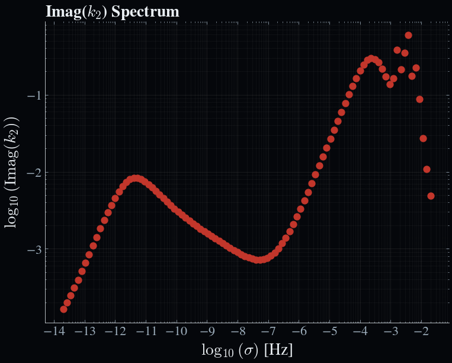

# One-dimensional test case: The Earth

This is an advanced test case to demonstrate the use of Obliqua for a one-dimensional model of the Earth. We will create a basic data lookup table for the Earth's tidal ``k``-Love number response, and map out the radial distribution of thedissipative tidal response. 

---

### Prerequisite

- Ensure that you have the `Obliqua` package installed.
- Attempt the zero-dimensional test case first.

---

### Creating the data file

This time the interior data will be provided, so it can simply be loaded using the `Obliqua.load` module. The file we will use is `res/interior_data/1d_test_earth.json`. 

---

### The configuration file

The configuration file should be a TOML file with the following structure:

```toml
title = "Earth"                     # Given title for the configuration file
version = "1.0"

[params]
    [params.out]
        path        = "out"         # Set the outpath for the output files
        time        = 0.0
        logging     = "INFO"
        plot_fmt    = "png"

# Orbital system
[orbit]
    [orbit.obliqua]
        store_3D    = false
        enforce_ec  = true          # Enable enforce energy conservation to clean up the tidal response at low frequencies
        optimize_scales = false
        solid_shell = false

        min_frac    = 0.05          # Set 5% of the radius as the minimum fraction of the radius to consider for the tidal response
        visc_l      = 1e2           # Set the liquid viscosity to 100 Pa s
        visc_lus    = 5e4           # Set the liquid-mush handoff viscosity to 5e4 Pa s
        visc_s      = 1e22          # Set the solid viscosity to 1e22 Pa s
        visc_sus    = 5e6           # Set the solid-mush handoff viscosity to 5e6 Pa s
        n           = [2]
        m           = [0, 2]
        spectrum    = "full"        # Specify the use of the full spectrum 
        N_sigma     = 100           # Set the number of probe forcing frequencies
        p_min       = -8            # Set the minimum probe forcing frequency (in [log(kyr)])
        p_max       = 4             # Set the maximum probe forcing frequency (in [log(kyr)])
        s_min       = "none"
        s_max       = "none"
        
        material_mu = "andrade"     # Set the rheological model to use for the shear modulus
        material_k  = "andrade"     # Set the rheological model to use for the bulk modulus
        alpha       = 0.3           # Set the Andrade power-law exponent.


        module_solid = "solid1d-relax"    # Set the tidal model to use for the solid layer
        module_mushy = "interp"     # Use interpolation for the mushy layer
        module_fluid = "fluid1d"    # Set the tidal model to use for the fluid layer

        [orbit.obliqua.solid]
            ncalc       = 100
            dr_min      = 10        # For relaxation models, set the minimum radial step size to 10 m
            dr_max      = 3000      # For relaxation models, set the maximum radial step size to 3000 m
            core        = "liquid"  # Set the core solution vector to be liquid
            core_props  = "core"    # Use core properties specified below for the core solution vector
            inertial_terms = true   # Include inertial terms in the tidal calculation
            bulk_l      = 1e9
            dbulk_power = 0.5
            porosity_thresh = 3e-2

        [orbit.obliqua.fluid]
            sigma_R     = 2e-3      # Rayleigh drag at the interface
            sigma_R_inf = 1e-3      # Rayleigh drag in the bulk fluid
            sigma_R_prf = "dynamic_interp"      # Use the detailed radial dissipation profile
            H_R         = 1e5       # The scale height associated with dissipation in the fluid layer
            efficiency  = 1e0

        [orbit.obliqua.mushy]
            b_width     = 5e-1      # Arbitrary smoothing width for the mushy layer from the solid
            t_width     = 3e-2      # Arbitrary smoothing width for the mushy layer from the fluid

[struct]
    core_density = 10738.33         # Core density used for the core solution vector. This is the density of the Earth's inner core.
    core_shear   = 0.0
    core_bulk    = 5e11

[interior_energetics]
    grain_size   = 0.1
```

Create it in the `res/config` directory of the Obliqua package and name it `earth_config.toml`. Key parameters to note are the `module_solid`, `module_mushy`, and `module_fluid` parameters, which specify the tidal model to use for the solid, mushy, and fluid layers, respectively. In this case, we are using the `solid1d_relax` model for the solid layer and the `fluid1d` model for the fluid layer. We are also using the `andrade` rheological model for both the shear and bulk moduli. For the full spectrum, we are using 100 probe forcing frequencies, which are logarithmically spaced between 10⁻⁸ and 10⁴ Hz. 


### Running the test case

With these files in place, we can now run the test case. The following code snippet demonstrates how to do this.

```julia
using Obliqua

# Clean up output directory
rm("out/",force=true,recursive=true)
if !isdir("out/") && !isfile("out/")
    mkdir("out/")
end

# Load configuration
cfg = Obliqua.open_config("res/config/earth_config.toml")

# Load interior model
omega, axial, ecc, sma, S_mass, rho, radius, visc, shear, bulk, phi, ncalc =
    load.load_interior_mush_full("res/interior_data/1d_test_earth.json", false)

# Extract mush zone properties
perm      = Obliqua.interior.get_permeability(phi, cfg)
perm, phi = Obliqua.interior.limit_porosity(perm, phi, cfg)
bulkd     = Obliqua.interior.get_drained_bulk(bulk, phi, cfg)

# Run tidal calculation
power_prf, power_blk, nmk, σ_range, LNk = Obliqua.run_tides(
    omega, axial, ecc, sma, S_mass, rho, radius, visc, shear, bulk, bulkd, phi, perm, cfg
)
```

!!! check 
    The filetree should look like this: 

    ```bash
    Obliqua/
    ├── 📂 res/
    │   ├── 📂 config
    |   │   └── 📄 earth_config.toml
    │   └── 📂 interior_data
    │       └── 📄 1d_test_earth.json
    ├── 📄 run_earth.jl
    ```

We can now run the script using 

```bash
julia --project run_earth.jl
```

---

### Expected output

At this point, the function will return several outputs in the terminal:

```bash
[ Info: Loading interior from JSON file: res/interior_data/1d_test_earth.json
[ Info: Using configuration 'Earth'
[ Info: Using (n, m, k) = (2, 0, 1) for full spectrum.
[ Info: Smoothing complex modulus profiles to avoid sharp jumps in viscosity...
[ Info: Smoothing between indices 15 and 20 (r = 3.14531757e6 to 3.21782745e6 m)
[ Info: Writing results to /home/marijn/LovePy/fwlLove.jl/out/0_obliqua.nc
[ Info: Expected bulk heating: 2.4659699632690844e14
[ Info: Obtained bulk heating: 2.4659699632690838e14
```

First, Obliqua will load the interior data and the configuration file. Next it will decide on which modes to include in the calculation. In this case, we are using the full spectrum, which restricts to the same mode for all forcing frequencies. Next, the complex modulus profiles are smoothed to avoid sharp jumps in viscosity, which can cause numerical instabilities. Finally, the results are written to a NetCDF file in the `out` directory. The expected bulk heating is also printed to the terminal, which is the total tidal dissipation rate in Watts. However, this is not relevant for the full spectrum. The obtained bulk heating is also printed, which is the total radially integrated tidal dissipation rate from the heating profile in Watts, and should match the expected value for all one-dimensional models.

Let us now run the `examples/visualize_output.ipynb` notebook to visualize the results. The output should look like this:



Here we see the imaginary part of the tidal ``k``-Love number as a function of the forcing frequency. We see both the solid and fluid contributions to the tidal response. The solid contribution is dominant at low frequencies, while the fluid contribution is dominant at high frequencies. This is the expected behaviour for a partially molten Earth. In addition, we observe high frequency resonances in the tidal response.


